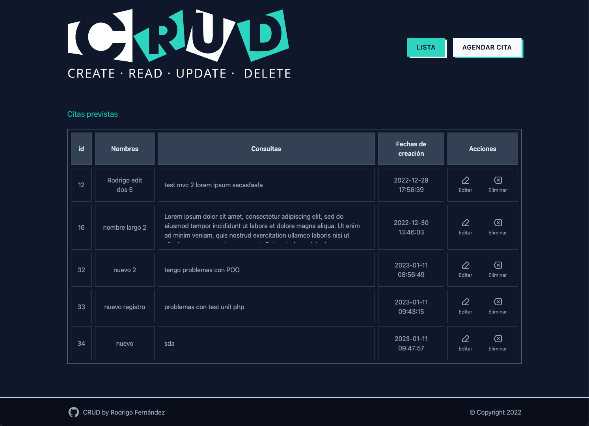

# CRUD - PHP
<p>Proyecto del bootcamp fullstack de Factoría F5</p>
<hr style="background:#2dd4bf;"/>
<p>Aplicación que permite pedir cita a los desrrolladores para resolver problemas técnicos de los equipos de desarrollo.</p>



## Requerimientos


- Instalar PHP
- Instalar Xamp/Wamp/etc..
  - Ejecutar Apache
  - Ejecutar MySQL databse
- Instalar Composer
  - Ejecutar en terminal
    ```sh
      composer install
    ```
<hr style="background:#2dd4bf;"/>

## Crear la base de datos
<p>Para la correcta ejecución de la aplicación se debe de crear una base de datos Myslq y una tabla.</p>
<p>A continuación la linea de comandos SQL que puedes usar en PhpMyAdmin para crear la base de datos "CRUDO" y la tabla "problemas":</p>

1 - Crear Base de datos: `CRUDO`
```sql
create database CRUDO;
use CRUDO;
```
2 - Estructura de tabla para la tabla `problemas`
```sql
CREATE TABLE `problemas` (
  `id` int NOT NULL AUTO_INCREMENT,
  `nombre` varchar(255) NOT NULL,
  `consulta` text NOT NULL,
  `fecha` timestamp NOT NULL DEFAULT current_timestamp(),
  PRIMARY KEY (id)
    ) ENGINE=InnoDB DEFAULT CHARSET=utf8mb4 COLLATE=utf8mb4_general_ci;
```

<hr style="background:#2dd4bf;"/>


### PHPUnit Test:

Linea de comando para ejecutar los test 

```sh
./vendor/bin/phpunit
```